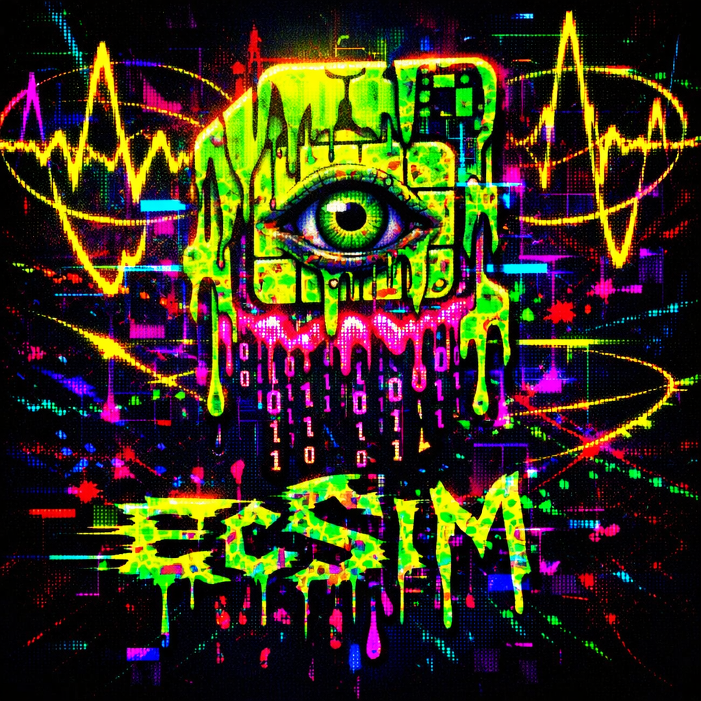
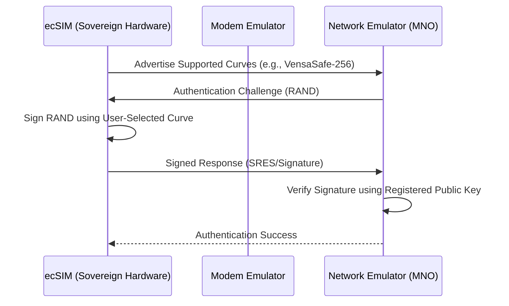

# 🛰️ VensaSIM (ecSIM): The Sovereign SIM Protocol

<p align="center">
  
</p>

[](https://opensource.org/licenses/MIT)
[](http://ethchiangmai.com)
[](#)

> **"Not your hardware, not your keys. Not your hardware, not your identity."**

VensaSIM is a radical blueprint for a **Sovereign SIM Card (ecSIM)** standard. Built on the principles of cryptographic agility and radical transparency, it aims to dismantle the "black box" of modern telecommunications by allowing users to verify, choose, and even define the cryptographic primitives used for their mobile authentication.

---

## 🏔️ The Vision: Open Silicon & Cryptographic Sovereignty

Inspired by **Vitalik Buterin's Vensa initiative** and the Cypherpunk ethos, ecSIM addresses the critical vulnerability of modern digital identity: the opaque hardware sitting in our phones.

### The Problem: The SIM "Black Box"
1. **Proprietary Opacity**: Current SIM/eSIM hardware and firmware are trade secrets. You cannot audit the silicon layout or the Java Card OS running your most sensitive keys.
2. **Standardized Betrayal**: Opaque parameter generation in NIST curves and structural anomalies in Koblitz curves (like the 166-bit `x` coordinate property in `secp256k1`) suggest potential backdoors or "cooked" parameters.
3. **Centralized Chokepoints**: The eSIM remote provisioning architecture (GSMA PKI) creates a global kill-switch, where network access is a permission, not a right.

---

## 🛠️ Key Features of ecSIM

### 1. Cryptographic Agility
Users are no longer forced to use a single, hardcoded algorithm. The ecSIM allows you to:
- **Select Vetted Curves**: Use high-assurance curves like `Curve25519`.
- **Define Custom Curves**: Load your own parabolic/elliptic parameters (subject to on-device SafeCurves validation).
- **Reject Opaque Standards**: Opt-out of NIST-P256 or other "suspicious" primitives.

### 2. Radical Transparency
- **Open-Source Stack**: From the RISC-V/FPGA hardware design to the `VensaApplet` firmware.
- **Verifiable Authentication**: A clean-slate challenge-response protocol that avoids legacy baggage and known vulnerabilities like Milenage/COMP128 flaws.

### 3. Protection Against Hidden Backdoors
The ecSIM protocol includes logic to detect and reject curves with structural weaknesses, such as:
- **Backdoor-166 Check**: Validates that the curve doesn't exhibit the "point divisor by two" coordinate leakage.
- **RFC 6979 Compliance**: Ensures deterministic nonce generation for ECDSA to prevent private key leakage via `k`-reuse.

---

## 🏗️ Technical Architecture

### Challenge-Response Flow


### Emulation Suite
This repository contains a full Python-based emulation of the VensaSIM ecosystem:
- `crypto_math.py`: Elliptic curve engine supporting custom parameters and "SafeCurves" validation.
- `vensasim_emulator.py`: Emulates the secure element logic, key management, and signing.
- `network_emulator.py`: Simulates the Mobile Network Operator's authentication server.
- `modem_emulator.py`: The interface bridge.

---

## 🚀 Getting Started

### Prerequisites
- Python 3.10+
- `hashlib`, `collections` (Standard Libraries)

### Running the Demo
The demo showcases a full lifecycle: Key generation on a custom curve, registration with a network, and a secure authentication handshake.

#### 🎥 Demo Video
https://github.com/cozsta/ecsim/raw/main/demo.mp4

```bash
python3 demo_en/main.py
```

---

## 🗺️ Roadmap
- [ ] **Hardware PoC**: Implementation on Lattice iCE40 / RISC-V FPGA.
- [ ] **VensaApplet**: A Rust-based open-source applet for sovereign identity.
- [ ] **NFC Interface**: Bringing ecSIM to physical proximity for secure login.
- [ ] **Decentralized Provisioning**: Replacing GSMA PKI with on-chain identity verification.

---

## 📜 Manifesto
*In the 21st century, the internet is real life. If our primary key to that life is a proprietary black box, we are not free. ecSIM is the first step toward reclaiming our digital borders.*

**Built for ETHChiangMai 2025.** 🇹🇭

---
*Disclaimer: This is a research prototype and cryptographic proof-of-concept. Use for educational purposes only.*
